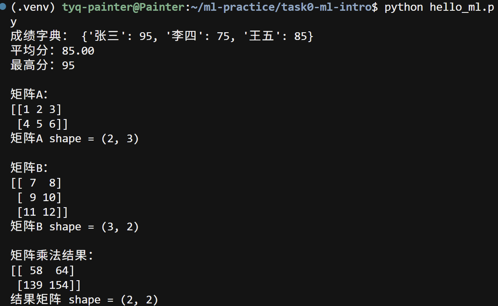

# 思考题01
### 1.人工智能、机器学习与深度学习之间有什么关系？  
- 包含关系，人工智能包含ml,ml包含深度学习。
### 2.监督学习和无监督学习有什么区别？请各举一个例子。  
- 训练数据有无标签。  
- 例子：监督学习，分类算法检测乳腺癌  。
无监督学习，异常检测检测异常事件。
### 3.数据、特征和标签分别是什么？训练集、验证集和测试集各有什么用途？  
- 数据：原始采集得到的全部信息，机器学习的原材料。
- 特征：从原始数据中提取出来描述样本的属性。
- 标签：预测的目标。
- 训练集：训练模型，使其学习特征与标签的规律。
- 验证集：调超参数（学习率、batch size等），评估模型训练效果，挑选最优模型。
- 测试集：模拟真实场景，评估模型泛化能力。
### 4.batch size是什么？有什么影响？   
- batch size：一次梯度更新时，所使用的样本数量  
- 影响： batch size越大，内存占用越高；梯度估计更稳定，但单次迭代计算量大，收敛速度变慢；batch size越小，单次迭代计算更快；梯度噪声更大，可带来一定正则效果，但参数更新震荡明显。
### 5.什么是模型和模型参数？  
- 模型：表示输入到输出映射关系的函数，用于根据特征预测结果。
- 模型参数：模型内部待学习的变量，训练过程会自动优化，用来拟合数据。例如线性回归的权重w和偏置b。

### 6.神经网络由哪些基本部分组成？什么是激活函数？为什么要激活函数？请介绍几种常见的激活函数。  
- 组成：输入层，隐藏层，输出层
- 激活函数：作用在神经元输出上的非线性函数。
- 为什么要用激活函数：如果没有激活函数，无论多少层网络，都等价于线性变换，无法学习复杂非线性关系；激活函数引入非线性，让神经网络可以拟合复杂数据。
- 常见激活函数：Sigmoid、Tanh、ReLU。

### 7.矩阵如何求导？  
- 矩阵求导，是**多元函数求偏导**向向量、矩阵的扩展。核心规则：把矩阵看作一堆标量元素的集合，函数输出如果是标量，就对矩阵内每一个元素分别求偏导，将结果按原矩阵的行列排布，得到梯度矩阵。在神经网络里，主要用来计算损失对权重W、偏置b的梯度，供反向传播更新参数。
### 8.怎么用矩阵乘法表示神经网络的全连接层前向传播过程？  
- 全连接前向传播：Z=WX+b，A=\sigma(Z)。利用矩阵乘法批量计算所有样本的加权和，叠加偏置后，再通过激活函数得到本层输出，作为下一层输入。
### 9.前向传播与反向传播分别在做什么？损失函数、梯度和学习率在训练过程中扮演什么角色？  
- 向前传播：从输入算出模型预测结果 。 
- 反向传播：算误差，回头改参数  。
- 损失函数：衡量模型预测值和真实值之间差距 。 
- 梯度：表示损失在参数空间变化的方向  。
- 学习率：控制每次参数更新的步长。
### 10.优化器是什么？有哪些？
- 优化器：优化器就是用来执行梯度下降、更新模型参数，从而最小化代价函数的算法。它利用反向传播算出的梯度，按照特定规则调整权重与偏置，让模型不断降低损失。
- 常见优化器：梯度下降(GD)、随机梯度下降(SGD)、小批量梯度下降(Mini-batch SGD)、Momentum、RMSprop、Adam。
### 11.什么是过拟合，欠拟合，正则化？  
- 过拟合：模型不能很好地拟合训练集 。 
- 欠拟合：模型对数据过度拟合  。
- 正则化：解决过拟合的方法。

# 思考题02

# 思考题03

### ① 为什么不同项目最好用不同 Python 虚拟环境？
每个项目依赖的包和版本往往不一样。虚拟环境把一套 Python 解释器和第三方包隔离在自己的目录里，互不影响。这样项目 A 可以锁 torch 2.1，项目 B 用 torch 2.14，不会互相覆盖；也不会把实验包装进系统 Python，避免把整台机器的环境弄乱。复现实验、交作业、换机器时，也可以按项目单独导出 `requirements.txt`，依赖更清晰。

### ② CPU 和 GPU 各自擅长什么？训练神经网络为什么经常用 GPU？
CPU 核心少、单核强，适合分支多、逻辑复杂、串行任务（操作系统、数据预处理、控制流）。
GPU 核心极多、擅长同一条指令同时处理大量数据，也就是大规模矩阵乘加。

神经网络训练里，前向传播、反向传播主要就是一层层的矩阵运算；这些运算可以并行，GPU 吞吐远高于 CPU。所以同样的模型，GPU 往往能把训练从“按天”压到“按小时/分钟”。没有独显时用 CPU 完全可以学习、跑小模型，只是大网络会慢很多。

### ③ CUDA 是什么？它、显卡驱动、PyTorch 之间大致什么关系？
CUDA 是 NVIDIA 提供的 GPU 并行计算平台和编程接口。
可以理解为：显卡是硬件，驱动让操作系统识别这块显卡，CUDA 提供接口让程序把计算任务下发到 GPU 执行，PyTorch 将张量运算翻译成 CUDA 内核。

分层关系：
1. NVIDIA 显卡：硬件
2. 显卡驱动：内核级软件，识别与管理 GPU
3. CUDA Toolkit / CUDA Runtime：基于驱动，提供编程与运行接口
4. PyTorch（GPU版）：调用 CUDA，在 GPU 上执行张量运算
